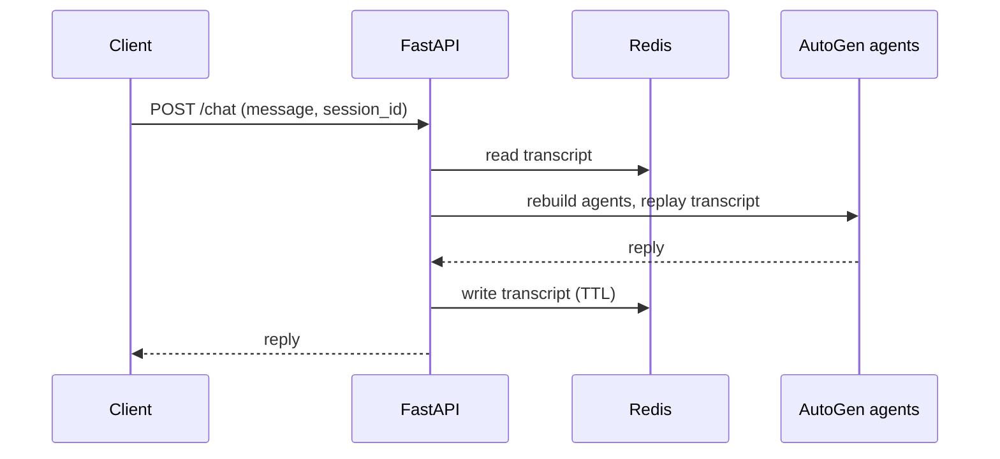

# multi-agent-chat

A FastAPI service that puts a conversational agent behind an HTTP endpoint, built on [AutoGen](https://microsoft.github.io/autogen/) with Redis holding the conversation state.

The problem it solves is the one every agent framework runs into when it leaves the notebook: agents are stateful objects and HTTP requests are not. This keeps the transcript in Redis and rebuilds the agents around it on each call.

## The API

| Method | Path     | Body                      |
| ------ | -------- | ------------------------- |
| `POST` | `/chat`  | `{ message, session_id }` |
| `GET`  | `/`      | —                         |

The response carries the `session_id` and the assistant's reply. Sending the same `session_id` again continues the conversation.

Interactive documentation is at `/docs`, with a ReDoc rendering at `/redoc`.

## How a session survives between requests



Two agents are constructed per request: an `AssistantAgent` carrying the system prompt, and a `UserProxyAgent` standing in for the customer with manual input disabled, since there is no human at a terminal to ask. The stored transcript is replayed into both before the new message arrives, so the model sees the whole conversation even though the objects holding it were created moments earlier.

Sessions expire on their own. Redis carries the TTL, so nothing needs to sweep old conversations.

## Configuration

```
REDIS_HOST=localhost
REDIS_PORT=6379
REDIS_DB=0
CHAT_SESSION_TTL=24:00:00
OAI_CONFIG_LIST=[{"model":"...","api_type":"...","api_key":"...","base_url":"...","api_version":"..."}]
```

`OAI_CONFIG_LIST` is AutoGen's provider list, parsed and validated by Pydantic rather than trusted as raw JSON. Because each entry carries `api_type`, `base_url`, and `api_version`, the service works against Azure OpenAI as readily as against the public API, and several entries let AutoGen fall back between providers. The API key is held as a `SecretStr`, so it will not surface in a log line or a stack trace.

The assistant's persona lives in `src/prompts/assistant.prompt`, outside the code, so changing its behaviour is not a deployment of new logic.

## Running it

Requires Python 3.11+ and Docker.

```bash
git clone https://github.com/jesusroncal94/multi-agent-chat.git
cd multi-agent-chat
cp .env.example .env
```

Fill in `OAI_CONFIG_LIST` with a real provider before starting. The example carries placeholders, and `base_url` is validated as a URL, so the placeholder fails on import of `config.py` with a Pydantic error rather than surfacing later on the first request.

Then:

```bash
docker compose up redis -d
uv run src/main.py
```

The service listens on <http://localhost:8000>. Dependencies are also available through `requirements.txt` for a plain `pip install`.

## How the code is organised

```
src/
├── main.py              Entry point
├── app.py               Application factory
├── endpoints.py         Routes, agent construction, and session handling
├── config.py            Validated settings, including the provider list
└── prompts/             The assistant's system prompt
```

## Notes

The current configuration runs one assistant against a user proxy. AutoGen's group conversations are what the architecture is there to allow — adding a second specialist agent is a change in `create_agents`, not a change in how sessions or transport work.

## License

MIT — see [LICENSE](LICENSE).
